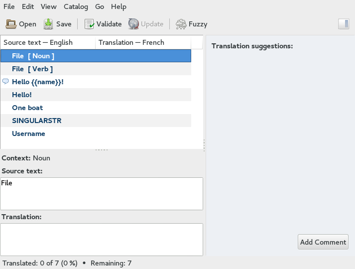
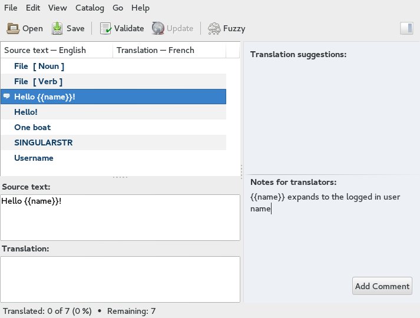

# Using the `translate` directive

Strings are marked as translatable using the `translate` directive. Here's a simple example:

```xml
<h1 translate>Hello!</h1>
```

This div will automatically be translated using the translated strings (which we'll define later on). For instance, in Dutch, it might read `Hallo!`.

You can also use the `translate` directive as an element:

```xml
<translate>Hello!</translate>
```

## Plurals

Plural strings can be annotated using two extra attributes: `translate-n` and `translate-plural`:

```xml
<div translate translate-n="boatCount" translate-plural="{{$count}} boats">One boat</div>
```

The general format is:

```xml
<div translate translate-n="COUNTEXPR" translate-plural="PLURALSTR">SINGULARSTR</div>
```

Depending on the value of `COUNTEXPR`, either the singular string or the plural string will be selected.

Inside the strings, you can use any variable that is available in the scope. A special `$count` variable is also available, which resolves to the value of the `translate-n` attribute.

The `translate-n` attribute accepts any valid Angular.JS expression, even functions.

## Interpolation

Full interpolation support is available in translated strings, so the following will work as expected:

```xml
<div translate>Hello {{name}}!</div>
```

## Attributes

Sometimes it's not an option to use an attribute (e.g. when you want to annotate an attribute value). There's a `translate` filter available for this purpose.

```xml
<input type="text" placeholder="{{'Username'|translate}}" />
```

This filter does not support plural strings.

You may want to use [custom annotations](/dev-guide/custom-annotations) to avoid using the `translate` filter all the time.

## Contexts

Contexts can be added to strings to be translated. The translation for the same string in a different context can be different.

You can use the `translate-context` directive to add contexts.

```xml
<h1 translate-context="Verb" translate>File</h1>
<h1 translate-context="Noun" translate>File</h1>
```

In the above example, the translator has to translate "File" twice for the two different contexts.

The contexts will appear in the catalog (as `msgctxt`).

In the application [Poedit](http://poedit.net/), the contexts will appear under "Context":



## Comments

Comments can be added to the catalog to help translators with the context of the translatable string.

You can use the `translate-comment` directive to add comments for translators.

A simple example:

```xml
<div translate-comment="{{name}} expands to the logged in user name" translate>Hello {{name}}!</div>
```
The comments will appear in the catalog.

In the application [Poedit](http://poedit.net/), the comment will appear under "Notes for translators" section:



<a href="/dev-guide/extract/" class="btn btn-primary">Next: Extracting strings</a>
